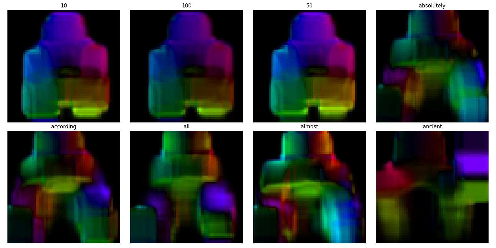

# PSL-TO-SPEECH-project
# PSL Sign Language to Urdu Speech

**GitHub:** https://github.com/bscs24133/PSL-to-speech-project

---

## Project Overview

This project builds a real-time Pakistan Sign Language (PSL) recognition system. The idea is simple a deaf or mute person performs a sign in front of a webcam, and the system recognizes that sign, converts it to Urdu text displayed on screen, and speaks it out loud in Urdu. No typing, no writing just sign and the computer speaks for you.

### Full Pipeline:
```
Live Webcam → Optical Flow → CNN Model → English Text → Urdu Text + Urdu Speech
```

The system works for both PSL **alphabet signs** (individual Urdu letters) and full **PSL words** (like mother, help, come, go).

---

## Current Progress

### What Has Been Completed So Far

#### Dataset Collection
Two datasets have been collected, downloaded, and fully organized on the local machine.

The first dataset is **UAlpha40 from Mendeley** — a research dataset covering the Urdu alphabet in PSL. It contains 36 letters that are expressed through a static hand shape (no movement needed) stored as JPG images, and 4 letters whose sign requires hand motion to complete stored as MP4 videos. These 4 dynamic letters are: 2-Hay, Alifmad, Aray, and Jeem. All 36 static signs have been split into train and test folders with an 80/20 ratio — 80% for training the model and 20% for testing how well it learned.

The second dataset is the **PSL Dictionary Toolkit** — scraped from the official Pakistan Sign Language website (psl.org.pk) using an automated pipeline. This contains 80 word-level PSL signs as MP4 videos. Words include everyday vocabulary like mother, father, help, come, go, car, brain, heart, continuously, and many more. These 80 videos have been split into 64 for training and 16 for testing.

Total dataset size is 5.77 GB across 23,499 files. Because of this size the dataset is stored locally only and is not uploaded to GitHub.

#### Data Pipeline
The entire data processing pipeline has been built and verified working. Here is exactly what was built:

**Frame Extraction** — Each MP4 video is processed by evenly sampling 16 frames from it regardless of the video length. Whether a video is 1 second or 5 seconds long, exactly 16 representative frames are extracted. Each frame is resized to 64x64 pixels for consistency. This is handled by `src/preprocess.py`.

**Optical Flow Computation** — This is the core of the data pipeline. Instead of feeding raw video frames into the CNN, we compute optical flow between consecutive frames. Optical flow is a computer vision technique that measures how every pixel in the image moved between two frames. The result is a motion map — bright colored areas show fast movement, dark areas show no movement. For a sign like "continuously" which involves a circular hand motion, the optical flow captures that circular pattern as a distinctive colorful swirl. This is handled by `src/optical_flow.py` using the Farneback algorithm from OpenCV.

The reason optical flow is used instead of raw frames is important — two completely different signs can have similar hand shapes in a single frame. What makes them different is the motion. Optical flow captures exactly that motion difference, making it much easier for the CNN to tell signs apart.

From 16 frames per video, 15 motion maps are computed (each map is between consecutive frame pairs). Each motion map is 64x64 pixels with 2 channels — one for horizontal movement and one for vertical movement. So each video becomes a (15, 64, 64, 2) numpy array saved as a .npy file.

**All 80 videos have been processed** — 64 training videos and 16 testing videos — and their optical flow arrays are saved to `Dataset/3_OpticalFlow/`.

**Data Augmentation** — Because only 4 dynamic alphabet videos exist, an augmentation function was written that multiplies each video into 4 versions: the original, a horizontally flipped version, a brightness adjusted version, and a version with Gaussian noise added. This gives the model more variety to learn from.

**Visual Verification** — The optical flow output was visually verified by converting the motion arrays into colorful HSV images. The visualization confirmed that different signs produce distinctly different motion patterns — signs 10, 100, absolutely, according, all, almost, and ancient all showed clearly different color patterns, proving the optical flow is correctly capturing unique motion signatures per sign.

All three verification tests passed:
- All 80 .npy files have the correct shape of (15, 64, 64, 2)
- Train count is 64, test count is 16, total is 80
- Visual comparison shows distinct patterns per sign

---

## Dataset Structure

```
Dataset/
├── 1_UAlpha40_Mendeley/
│   ├── static_signs/
│   │   ├── train/        → 36 letter folders (Alif, Bay, Pay, Seen...)
│   │   └── test/         → 36 letter folders
│   └── dynamic_signs/
│       └── raw_videos/   → 4 letter folders (2-Hay, Alifmad, Aray, Jeem)
├── 2_PSL_Dictionary_Toolkit/
│   ├── original/         → 80 word MP4 videos
│   ├── train/            → 64 word folders
│   └── test/             → 16 word folders
└── 3_OpticalFlow/        → generated by optical_flow.py
    ├── train/            → 64 .npy arrays, shape (15, 64, 64, 2)
    └── test/             → 16 .npy arrays, shape (15, 64, 64, 2)
```

---

## Project Structure

```
PSL-to-speech-project/
├── src/
│   ├── config.py           → all dataset paths and model settings
│   ├── preprocess.py       → extracts 16 frames from each video
│   ├── optical_flow.py     → computes Farneback optical flow
│   ├── verify_flow.py      → visual verification of flow output
│   ├── train.py            → CNN model training (Phase 2)
│   ├── evaluate.py         → confusion matrix and accuracy (Phase 2)
│   ├── translate.py        → English to Urdu translation (Phase 3)
│   └── app.py              → live webcam application (Phase 3)
├── models/                 → saved .h5 model files
├── outputs/
│   ├── flow_sample.png     → single sign optical flow visualization
│   └── flow_comparison.png → 8 signs compared side by side
├── requirements.txt
└── README.md
```

---

## Setup Instructions for New Machine

### Step 1 — Clone the Repository
```bash
git clone https://github.com/bscs24133/PSL-to-speech-project.git
cd PSL-to-speech-project
```

### Step 2 — Install Dependencies
```bash
pip install -r requirements.txt
```

### Step 3 — Download the Dataset
Download both datasets and organize into the structure shown above.

| Dataset | Source |
|---------|--------|
| UAlpha40 | https://data.mendeley.com/datasets/3pvnnckxyb/2 |
| PSL Dictionary | https://github.com/hmhamza/psl-dataset |

### Step 4 — Update config.py
Open `src/config.py` and update all paths to match your machine:
```python
STATIC_TRAIN = r'YOUR_PATH\Dataset\1_UAlpha40_Mendeley\static_signs\train'
STATIC_TEST  = r'YOUR_PATH\Dataset\1_UAlpha40_Mendeley\static_signs\test'
WORD_TRAIN   = r'YOUR_PATH\Dataset\2_PSL_Dictionary_Toolkit\train'
WORD_TEST    = r'YOUR_PATH\Dataset\2_PSL_Dictionary_Toolkit\test'
FLOW_OUTPUT  = r'YOUR_PATH\Dataset\3_OpticalFlow'
```

### Step 5 — Generate Optical Flow
```bash
cd src
python optical_flow.py
```

---

## Tech Stack

| Category | Libraries |
|----------|-----------|
| Computer Vision | OpenCV, scikit-image |
| Deep Learning | TensorFlow, Keras |
| Data Processing | NumPy, MoviePy |
| Translation | deep-translator |
| Text to Speech | gTTS, pygame |
| Visualization | matplotlib |

---

## Sample Output

Optical flow visualization showing motion patterns captured from 8 different PSL signs. Each sign produces a distinctly different color pattern — this is what the CNN learns to classify.



---

## Requirements
- Python 3.10+
- Webcam for live recognition
- 8GB RAM recommended
- GPU optional but recommended for training
